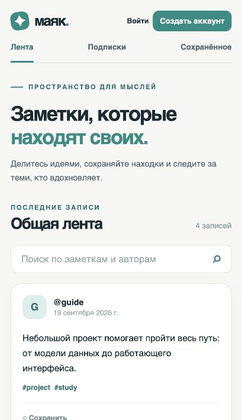

# Маяк

[](https://github.com/YjastherY/pipnya/actions/workflows/tests.yml)
[](https://qlty.sh/gh/YjastherY/projects/pipnya)

Для учебной практики я разработал «Маяк» — микроблог для коротких заметок. Здесь можно публиковать записи с тегами, искать материалы, подписываться на авторов и сохранять интересные публикации. Основой стала тема [Build a Microblog with Flask](https://blog.miguelgrinberg.com/post/the-flask-mega-tutorial-part-i-hello-world) из каталога [Project Based Learning](https://github.com/practical-tutorials/project-based-learning#python).



## Возможности

- регистрация и вход с безопасным хранением хеша пароля;
- создание, редактирование и удаление собственных заметок;
- теги, поиск и постраничная выдача публикаций;
- профили авторов и лента подписок;
- сохранённые заметки;
- проверка целостности и резервное копирование SQLite.

## Стек

| Слой | Технологии |
| --- | --- |
| Интерфейс | HTML, CSS, JavaScript |
| Сервер и API | Python 3.11+, Flask 3.1 |
| База данных | SQLite 3 |
| Тесты | `unittest`, тестовый клиент Flask |
| Развёртывание | Docker, Gunicorn, Render |

## Онлайн-версия

- Сайт: [https://mayak-yjasthery.onrender.com](https://mayak-yjasthery.onrender.com)
- Проверка состояния: [https://mayak-yjasthery.onrender.com/api/health](https://mayak-yjasthery.onrender.com/api/health)
- Тестовый пользователь: `demo`
- Пароль тестового пользователя передаётся проверяющему в техническом паспорте отчёта.

На бесплатном экземпляре Render файловая система временная, поэтому демонстрационные данные восстанавливаются при перезапуске. Для постоянного хранения пользовательских данных следует подключить Persistent Disk и оставить базу по пути `/data/microblog.sqlite3`.

## Локальный запуск

```bash
python -m venv .venv
source .venv/bin/activate
pip install -r requirements.txt
flask --app run.py run
```

После запуска сайт доступен по адресу `http://127.0.0.1:5000`. При первом старте приложение создаёт базу данных в `instance/microblog.sqlite3`. В Windows окружение активируется командой `.venv\Scripts\activate`.

Чтобы добавить демонстрационные записи и аккаунт `demo`, нужно задать пароль длиной от 10 символов и выполнить команду:

```bash
export DEMO_PASSWORD="выбранный-пароль"
flask --app run.py seed-demo
```

Команда не выводит пароль и при повторном запуске не дублирует записи.

## Проверка проекта

```bash
python -m unittest discover -s tests -v
flask --app run.py check-db
flask --app run.py backup-db backups/microblog.sqlite3
```

Для проверки стиля используются зависимости из `requirements-dev.txt`:

```bash
pip install -r requirements-dev.txt
ruff check app tests run.py
ruff format --check app tests run.py
```

Тесты, Ruff и проверка синтаксиса JavaScript также запускаются в GitHub Actions. Бейдж Qlty показывает оценку сопровождаемости A; Qlty Cloud является актуальной заменой Code Climate Quality.

## Развёртывание

В корне находится `render.yaml` с готовой конфигурацией Render Blueprint. Во время создания сервиса требуется задать только `DEMO_PASSWORD`; `SECRET_KEY` генерируется автоматически. Контейнер создаёт демонстрационные данные и запускает Gunicorn на порту, предоставленном хостингом.

Для ручного контейнерного запуска:

```bash
docker build -t mayak .
docker run --rm -p 8000:8000 \
  -e SECRET_KEY="случайная-длинная-строка" \
  -e DEMO_PASSWORD="выбранный-пароль" \
  -v mayak-data:/data \
  mayak
```

## Документация

- [Архитектура, ERD и сценарии](docs/architecture.md)
- [Схема и обслуживание БД](docs/database.md)
- [Контракт API](docs/api.md)
- [Связь функций с кодом и страницами](docs/traceability.md)

Репозиторий проекта: [YjastherY/pipnya](https://github.com/YjastherY/pipnya).
