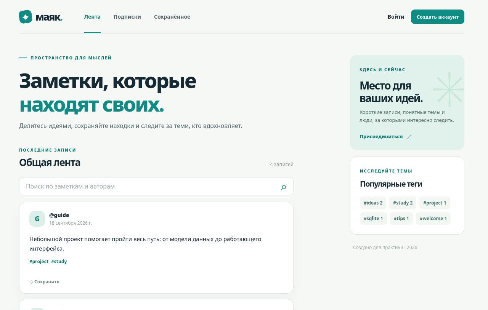

# Маяк

[](https://github.com/YjastherY/pipnya/actions/workflows/tests.yml)
[](https://qlty.sh/gh/YjastherY/projects/pipnya)

Я разработал «Маяк» — микроблог для коротких заметок. В нём можно публиковать записи с тегами, искать идеи, подписываться на авторов и сохранять интересные публикации. За основу взял тему [Build a Microblog with Flask](https://blog.miguelgrinberg.com/post/the-flask-mega-tutorial-part-i-hello-world) из [каталога Project Based Learning](https://github.com/practical-tutorials/project-based-learning). Интерфейс, API и схему данных реализовал для этого проекта.



## Возможности

- Регистрация и вход с хранением хеша пароля.
- Создание, редактирование и удаление своих заметок.
- Теги, поиск и постраничная выдача публикаций.
- Профили авторов и лента подписок.
- Сохранённые заметки.
- Резервное копирование и проверка целостности SQLite.

## Стек

| Слой | Технологии |
| --- | --- |
| Интерфейс | HTML, CSS, JavaScript |
| Сервер и API | Python 3.11+, Flask 3.1 |
| База данных | SQLite 3 |
| Тесты | `unittest`, тестовый клиент Flask |

## Локальный запуск

```bash
python -m venv .venv
source .venv/bin/activate
pip install -r requirements.txt
flask --app run.py run
```

После запуска сайт доступен по адресу `http://127.0.0.1:5000`. При первом запуске приложение создаёт базу данных в `instance/microblog.sqlite3`. На Windows окружение активируется командой `.venv\Scripts\activate` вместо `source`.

Для демонстрационных записей и аккаунта `demo` нужно задать в переменной `DEMO_PASSWORD` пароль длиной от 10 символов и выполнить `flask --app run.py seed-demo`. Команда не печатает пароль и при повторном запуске не дублирует записи. Пароль от размещённого сайта укажу проверяющему в отчёте.

## Проверка и обслуживание

```bash
python -m unittest discover -s tests -v
flask --app run.py check-db
flask --app run.py backup-db backups/microblog.sqlite3
```

Для проверки стиля кода нужны зависимости из `requirements-dev.txt`. Команды: `ruff check app tests run.py` и `ruff format --check app tests run.py`. Эти проверки, тесты и проверка синтаксиса JavaScript запускаются также в GitHub Actions.

Для размещения нужны `APP_ENV=production`, `SECRET_KEY` (случайная длинная строка) и `DATABASE_PATH` (путь на постоянном диске). Приложение запускается через WSGI-сервер:

```bash
gunicorn --bind 0.0.0.0:8000 run:app
```

SQLite используется с одним экземпляром приложения и постоянным диском. На хостинге с временной файловой системой данные пропадут после перезапуска, поэтому для деплоя нужно постоянное хранилище.

Для контейнерного запуска подготовил [Dockerfile](Dockerfile). При запуске нужно подключить постоянный том к `/data` и задать `SECRET_KEY`, а для демонстрационного аккаунта — `DEMO_PASSWORD`. Контейнер создаёт демонстрационные данные и запускает Gunicorn.

## Документация

- [Архитектура, ERD и сценарии](docs/architecture.md)
- [Схема и обслуживание БД](docs/database.md)
- [Контракт API](docs/api.md)
- [Связь функций с файлами и страницами](docs/traceability.md)

Репозиторий проекта: [YjastherY/pipnya](https://github.com/YjastherY/pipnya). Бейджи выше показывают результат проверок GitHub Actions и оценку сопровождаемости Qlty после завершения анализа. Ссылку на деплой добавлю после размещения сайта.
