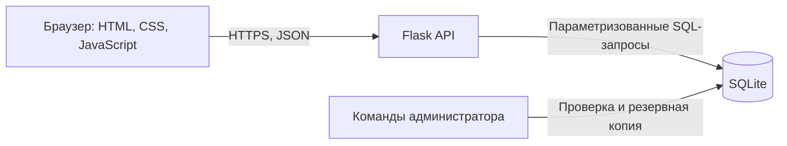
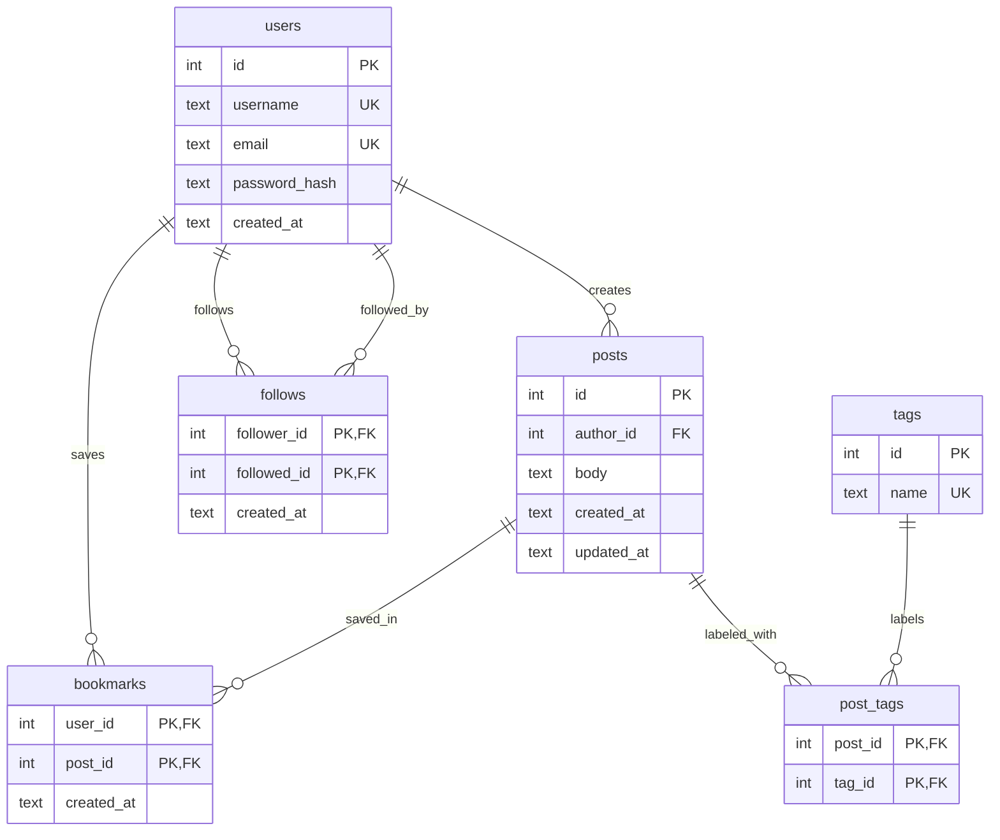

# Архитектура проекта

Источник темы: [Build a Microblog with Flask](https://blog.miguelgrinberg.com/post/the-flask-mega-tutorial-part-i-hello-world) из каталога Project Based Learning. «Маяк» развивает базовый микроблог: добавлены теги, поиск, подписки, сохранённые публикации, API и операции обслуживания БД.

## Общая схема

Браузер получает HTML и статические файлы от Flask. JavaScript отправляет запросы к `/api`, а сервер проверяет данные и права текущего пользователя. Состояние входа хранится в подписанной cookie сессии; хеш пароля лежит в таблице `users`. Все пользовательские данные записываются в SQLite через параметризованные запросы. Ограничения схемы и внешние ключи поддерживают целостность связей. Администратор может проверить базу и создать согласованную резервную копию через CLI.

## ERD

## Сценарии использования

| Сценарий | Шаги |
| --- | --- |
| Опубликовать заметку | Зарегистрироваться → ввести текст и до трёх тегов → отправить форму → увидеть запись в ленте. |
| Подписаться на автора | Открыть профиль автора → нажать «Подписаться» → открыть ленту подписок → увидеть его записи. |
| Сохранить заметку | Открыть ленту → нажать «Сохранить» → открыть «Сохранённое» → увидеть запись. |
| Найти и изменить свою запись | Открыть «Мои заметки» → найти запись → изменить текст и теги → сохранить и проверить результат. |

## Контроль доступа

Читать общую ленту, профили и искать записи может любой посетитель. Создавать записи, подписываться и сохранять записи может только вошедший пользователь. Изменять и удалять запись может только её автор. Операции записи защищены CSRF-токеном, а база недоступна через веб-сервер как статический файл.
